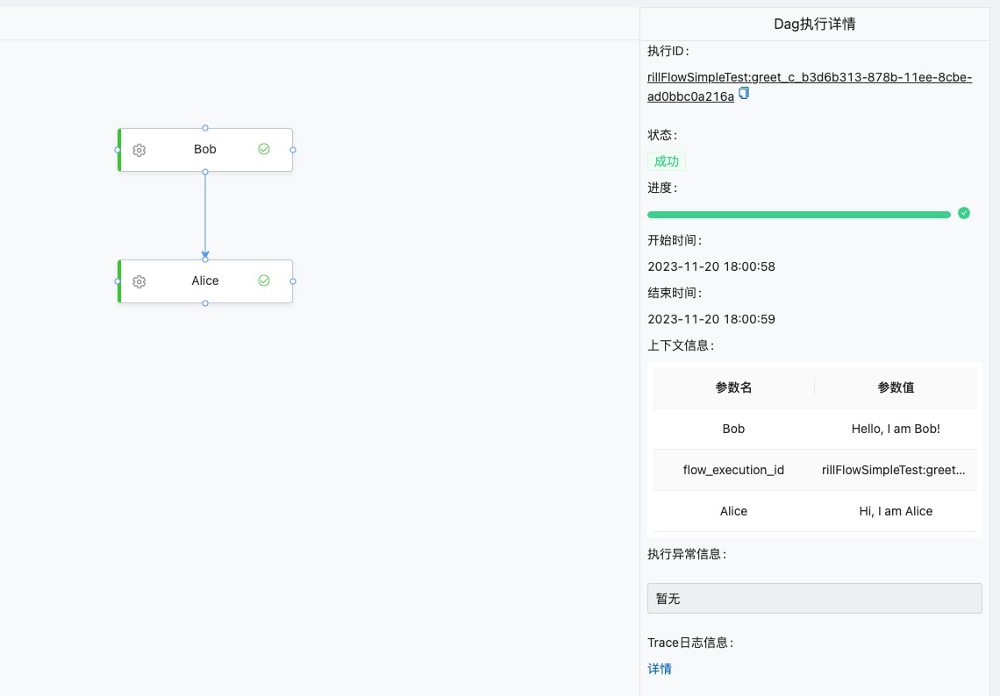

# 快速开始

## 环境准备

首先，您需要安装好对应的依赖环境，以及工具：

- OSX/Linux环境
- [Docker](https://www.docker.com/) 
- [MiniKube](https://minikube.sigs.k8s.io)
- [Kubectl](https://kubernetes.io/zh-cn/docs/reference/kubectl/kubectl/)
- [Helm](https://helm.sh)


### 在本机启动MiniKube
- 启动Minikube
```
minikube start --driver=docker --image-mirror-country=cn
```

- 检查Minikube集群状态

```
minikube status
```

- 设置Kubectl上下文为Minikube集群

```
kubectl config use-context minikube
```

- 验证Kubernetes集群状态

```
kubectl cluster-info
```

- 打开Kubernetes仪表板

```
minikube dashboard --url&
```


## 服务部署

```shell
helm install -n rill-flow rill-flow https://weibocom.github.io/rill-flow-helm-chart 
```

## 访问Rill Flow 管理后台

Rill Flow 的快速部署是基于 Kubernetes 的，因此需要通过 Kubernetes 的端口转发功能，将服务暴露到本地，才能通过本机 IP:端口 访问到 Rill Flow 管理后台、后端API接口以及trace 链路查询接口。


```shell
kubectl -n rill-flow --address 0.0.0.0 port-forward svc/rill-flow-service 8080:8080&
kubectl -n rill-flow --address 0.0.0.0 port-forward deployment/rill-flow-ui 9080:9080&
kubectl -n rill-flow --address 0.0.0.0 port-forward svc/rill-flow-jaeger-query 16686:16686&
```

执行成功后，可通过 `http://localhost:9080` 访问 Rill Flow 管理后台。

## 提交任务

### 提交简单流程任务

- Step 1: 提交 YAML 文件定义的流程图

```yaml
curl --location  --request POST 'http://127.0.0.1:8080/flow/bg/manage/descriptor/add_descriptor.json?business_id=rillFlowSimpleTest&feature_name=greet&alias=release' \
--header 'Content-Type: text/plain' \
--data-raw '---
version: 1.0.0
workspace: rillFlowSimpleTest
dagName: greet
type: flow
tasks:
  - category: function
    name: Bob 
    resourceName: http://127.0.0.1:8080/flow/sample/greet.json?user=Bob
    pattern: task_sync
    tolerance: false
    next: Alice
    inputMappings:
      - source: "$.context.Bob"
        target: "$.input.Bob"
  - category: function
    name: Alice 
    resourceName: http://127.0.0.1:8080/flow/sample/greet.json?user=Alice
    pattern: task_sync
    tolerance: false
    inputMappings:
      - source: "$.context.Alice"
        target: "$.input.Alice"
'
```

- Step 2: 提交流程图执行任务
  
```curl
curl -XPOST 'http://127.0.0.1:8080/flow/submit.json?descriptor_id=rillFlowSimpleTest:greet'  -d '{"Bob":"Hello, I am Bob!", "Alice": "Hi, I am Alice"}' -H 'Content-Type:application/json'
```

> 更多流程示例请参考[流程示例](/docs/getting-started/02-sample.md)

## 查看结果

### 查看运行结果

- 打开Rill Flow管理后台查询执行详情

```cURL
http://127.0.0.1:9080/#/flow-instance/list
```



> 更多关于查看结果的说明可以参考[执行状态](/docs/user-guide/04-execution/03-status.md)
## 接下来

- 查看[架构介绍](/docs/user-guide/01-arch.md)
