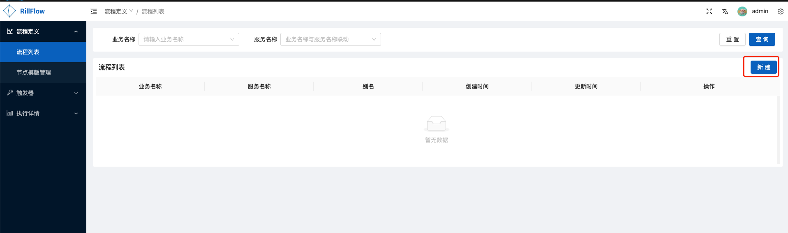
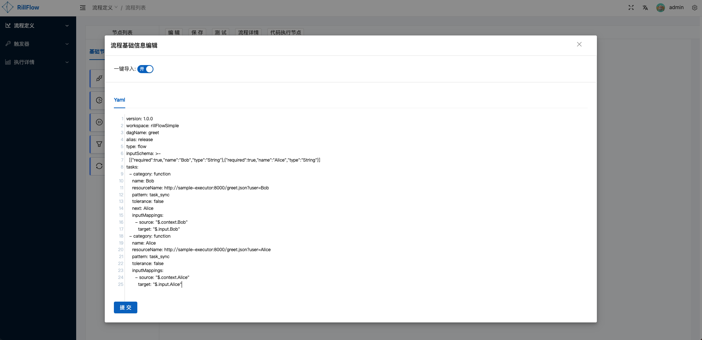
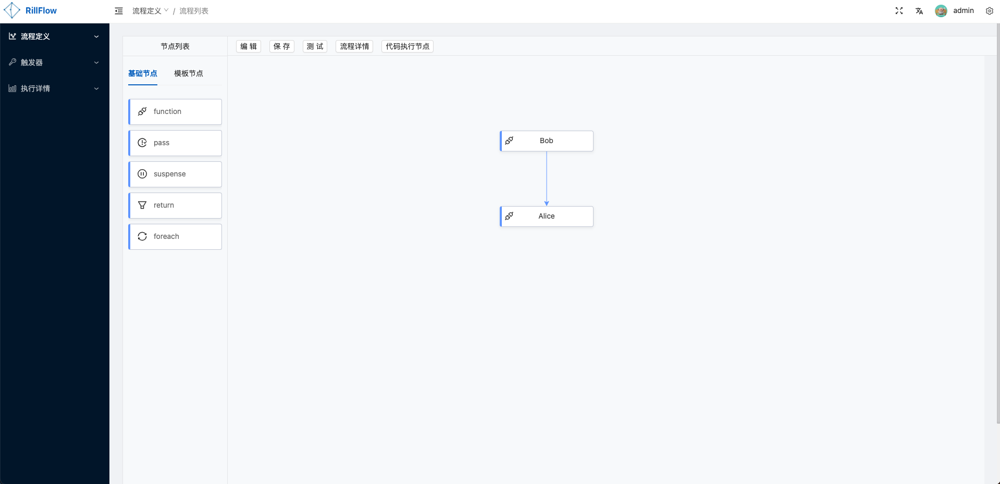
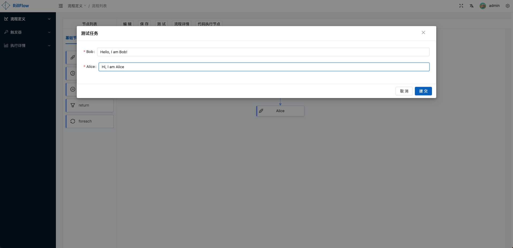
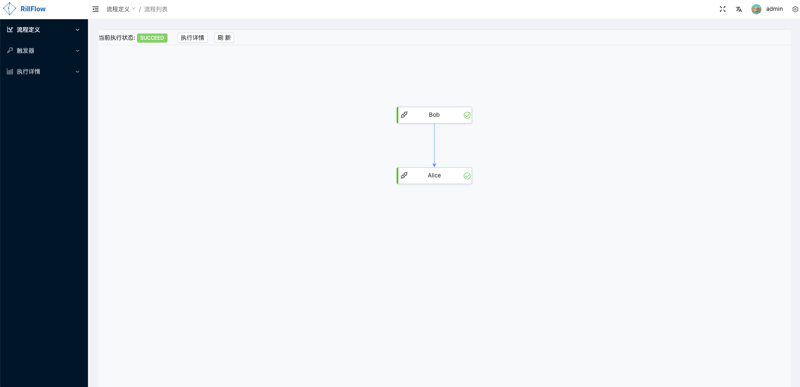
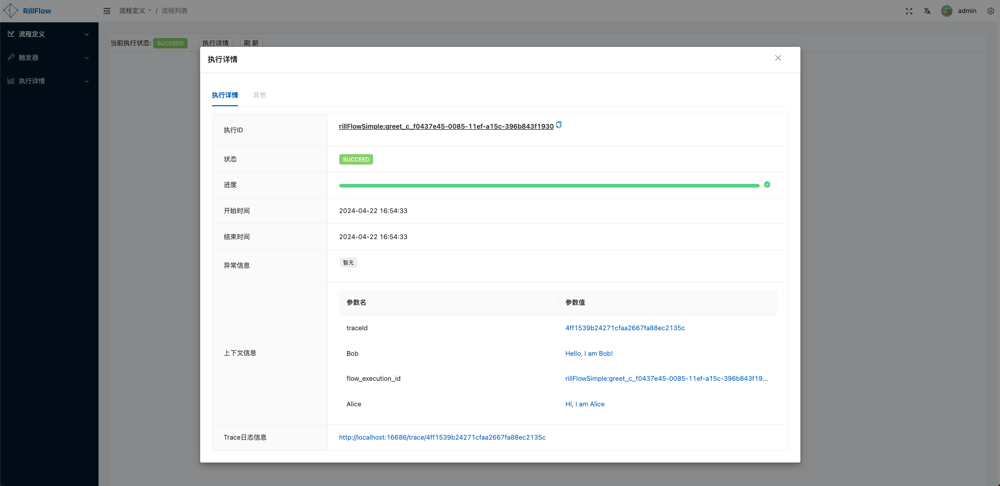

# 快速开始

## 环境准备

首先，您需要安装好对应的依赖环境，以及工具：

- OSX/Linux环境
- [docker](https://docs.docker.com/engine/install/)
- [docker-compose](https://docs.docker.com/compose/install/)


## 服务部署

### 下载Rill-Flow源码
```shell
git clone https://github.com/weibocom/rill-flow.git
```

### 启动服务
进入rill-flow源代码的docker目录，执行一键启动命令:

```shell
cd rill-flow/docker
docker-compose up -d
```
> 如果您的系统安装了 Docker Compose V2 而不是 V1，请使用 `docker compose` 而不是 `docker-compose`。通过`docker compose version`检查这是否为情况。在[这里](https://docs.docker.com/compose/#compose-v2-and-the-new-docker-compose-command)阅读更多信息。
 

## 验证安装

要查看 Rill Flow 的运行情况，请执行以下命令：

```shell
docker-compose ps
```

以下是预期输出：

```txt
           Name                         Command               State                                           Ports
------------------------------------------------------------------------------------------------------------------------------------------------------------
rill-flow-mysql              docker-entrypoint.sh --bin ...   Up      0.0.0.0:3306->3306/tcp, 33060/tcp
rillflow_cache_1             docker-entrypoint.sh redis ...   Up      6379/tcp
rillflow_jaeger_1            /go/bin/all-in-one-linux         Up      14250/tcp, 14268/tcp, 0.0.0.0:16686->16686/tcp, 5775/udp, 5778/tcp, 6831/udp, 6832/udp
rillflow_rill-flow_1         catalina.sh run                  Up      0.0.0.0:8080->8080/tcp
rillflow_sample-executor_1   uvicorn main:app --host 0. ...   Up
rillflow_ui_1                /docker-entrypoint.sh /bin ...   Up      0.0.0.0:80->80/tcp
```

如果你的实际输出与预期输出相符，表示 Rill Flow 已经成功安装。

## 访问Rill Flow 管理后台

执行成功后，可通过 `http://localhost` (admin/admin)访问 Rill Flow 管理后台。若为服务端部署，则直接使用服务器IP进行访问(端口默认为80)。

## 提交任务

### 提交简单流程任务
- Step 1: 打开 Rill Flow 管理后台，点击 `流程定义` 菜单，进入`流程列表`页面, 点击`新建`按钮。

- Step 2: 进入`新建流程`页面后，打开`一键导入`开关，将以下yaml文件内容复制到文本框中，点击`提交`按钮，即可提交简单的流程图。
```yaml
version: 1.0.0
workspace: rillFlowSimple
dagName: greet
alias: release
type: flow
inputSchema: >-
  [{"required":true,"name":"Bob","type":"String"},{"required":true,"name":"Alice","type":"String"}]
tasks:
  - category: function
    name: Bob
    resourceName: http://sample-executor:8000/greet.json?user=Bob
    pattern: task_sync
    tolerance: false
    next: Alice
    inputMappings:
      - source: "$.context.Bob"
        target: "$.input.Bob"
  - category: function
    name: Alice
    resourceName: http://sample-executor:8000/greet.json?user=Alice
    pattern: task_sync
    tolerance: false
    inputMappings:
      - source: "$.context.Alice"
        target: "$.input.Alice"
```



- Step 3: 提交流程图执行任务

点击`测试`按钮，填写所需参数后，点击`提交`按钮。



- Step 4: 查看执行结果
上一步点击`提交`按钮后会自动跳转到执行详情页。可通过点击`执行详情`按钮查看执行状态和详细内容。




> 更多关于查看结果的说明可以参考[执行状态](../user-guide/04-execution/03-status.md)

## 接下来

- 查看[更多示例](./02-sample.md)
- 查看[架构介绍](../user-guide/01-arch.md)
