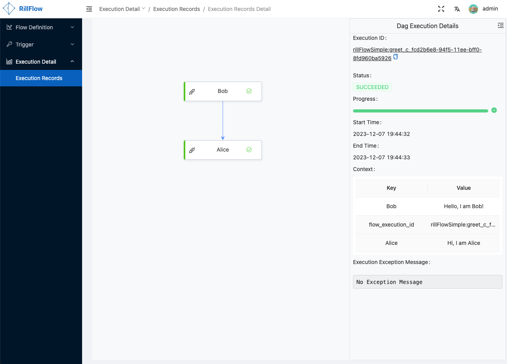

# 快速开始

## 环境准备

首先，您需要安装好对应的依赖环境，以及工具：

- OSX/Linux环境
- [docker](https://docs.docker.com/engine/install/)
- [docker-compose](https://docs.docker.com/compose/install/)


## 服务部署

```shell
cat << EOF > docker-compose.yaml
version: '3'
services:
  rill-flow:
    image: weibocom/rill-flow
    depends_on:
      - cache
    ports:
      - "8080:8080"
    environment:
      - rill_flow_descriptor_redis_host=cache
      - rill_flow_default_redis_host=cache
  cache:
    image: redis:6.2-alpine
    restart: always
    command: redis-server --save 20 1 --loglevel warning
  ui:
    image: weibocom/rill-flow-ui
    ports:
      - "8088:80"
    depends_on:
      - rill-flow
    environment:
      - BACKEND_SERVER=http://rill-flow:8080
EOF
docker-compose up -d
```

## 验证安装

要查看 Rill Flow 的运行情况，请执行以下命令：

```shell
docker ps
```

以下是预期输出：

```txt
CONTAINER ID   IMAGE                   COMMAND                  CREATED          STATUS          PORTS                    NAMES
6e2bc428861a   weibocom/rill-flow-ui   "/docker-entrypoint.…"   15 minutes ago   Up 15 minutes   0.0.0.0:8088->80/tcp     tmp_ui_1
711fcfe891eb   weibocom/rill-flow      "catalina.sh run"        18 minutes ago   Up 15 minutes   0.0.0.0:8080->8080/tcp   tmp_rill-flow_1
bef15e21146c   redis:6.2-alpine        "docker-entrypoint.s…"   39 minutes ago   Up 39 minutes   6379/tcp                 tmp_cache_1
```

如果你的实际输出与预期输出相符，表示 Rill Flow 已经成功安装。

## 访问Rill Flow 管理后台

执行成功后，可通过 `http://localhost:8088` (admin/admin)访问 Rill Flow 管理后台。

## 提交任务

### 提交简单流程任务

- Step 1: 提交 YAML 文件定义的流程图

```yaml
curl --location  --request POST 'http://127.0.0.1:8080/flow/bg/manage/descriptor/add_descriptor.json?business_id=rillFlowSimpleTest&feature_name=greet&alias=release' \
--header 'Content-Type: text/plain' \
--data-raw '---
version: 1.0.0
workspace: rillFlowSimpleTest
dagName: greet
type: flow
tasks:
  - category: function
    name: Bob 
    resourceName: http://127.0.0.1:8080/flow/sample/greet.json?user=Bob
    pattern: task_sync
    tolerance: false
    next: Alice
    inputMappings:
      - source: "$.context.Bob"
        target: "$.input.Bob"
  - category: function
    name: Alice 
    resourceName: http://127.0.0.1:8080/flow/sample/greet.json?user=Alice
    pattern: task_sync
    tolerance: false
    inputMappings:
      - source: "$.context.Alice"
        target: "$.input.Alice"
'
```

- Step 2: 提交流程图执行任务
  
```curl
curl -XPOST 'http://127.0.0.1:8080/flow/submit.json?descriptor_id=rillFlowSimpleTest:greet'  -d '{"Bob":"Hello, I am Bob!", "Alice": "Hi, I am Alice"}' -H 'Content-Type:application/json'
```

> 更多流程示例请参考[流程示例](02-sample.md)

## 查看结果

### 查看运行结果

- 打开Rill Flow管理后台查询执行详情

```cURL
http://127.0.0.1:8088/#/flow-instance/list
```



> 更多关于查看结果的说明可以参考[执行状态](../user-guide/04-execution/03-status.md)

## 接下来

- 查看[架构介绍](../user-guide/01-arch.md)
