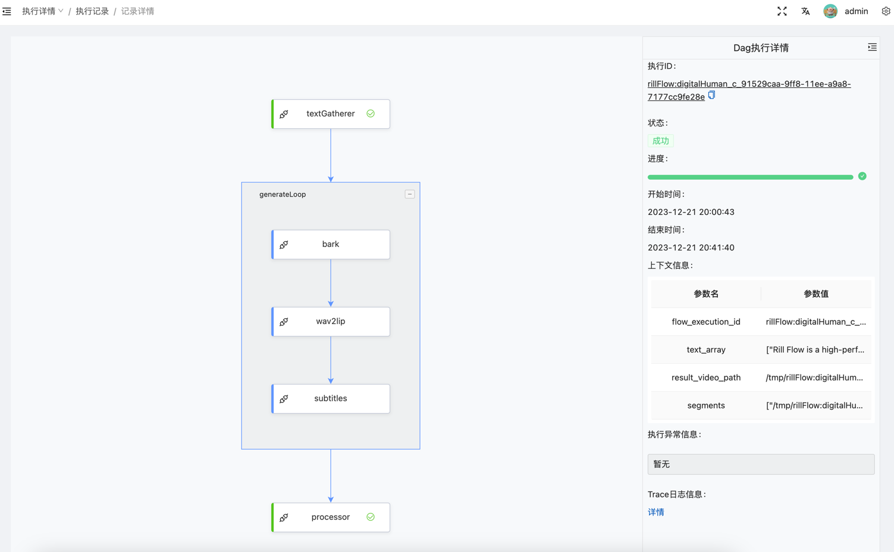

# 更多示例

## 流程控制


[yaml定义文件](https://github.com/weibocom/rill-flow/blob/main/docs/samples/choice-sample.yaml)

```cURL
curl --location 'http://127.0.0.1:8080/flow/submit.json?descriptor_id=rillFlowSample:choiceSample' \
--header 'Content-Type: application/json' \
--data '{
     "input_num":10
}'
```

## 调用API并处理结果


[yaml定义文件](https://github.com/weibocom/rill-flow/blob/main/docs/samples/call-api-sample.yaml)
* 启动sample api服务
```Bash
cat <<EOF > docker-compose-sample.yaml
version: '3'
services:
  sample-executor:
    image: weibocom/rill-flow-sample:sample-executor 
EOF
docker-compose up -d
```
```cURL
curl --location 'http://127.0.0.1:8080/flow/submit.json?descriptor_id=rillFlowSample:callApiSample' \
--header 'Content-Type: application/json' \
--data '{
     "input_num":10
}'
```
## 并行和异步处理


[yaml定义文件](https://github.com/weibocom/rill-flow/blob/main/docs/samples/parallel-async-dag.yaml)

* 启动sample api服务
```Bash
cat <<EOF > docker-compose-sample.yaml
version: '3'
services:
  sample-executor:
    image: weibocom/rill-flow-sample:sample-executor 
EOF
docker-compose up -d
```
```cURL
curl --location 'http://127.0.0.1:8080/flow/submit.json?descriptor_id=rillFlowSample%3AparallelAsyncTask' \
--header 'Content-Type: application/json' \
--data '{
    "rand_num":20
}'
```

## 引用子图


[yaml定义文件](https://github.com/weibocom/rill-flow/blob/main/docs/samples/ref-dag.yaml)

```cURL
curl --location 'http://127.0.0.1:8080/flow/submit.json?descriptor_id=rillFlowSample%3AsubdagTask' \
--header 'Content-Type: application/json' \
--data '{
    "parent_rand_num":20
}'
```


## 接收kafka消息后调用AIGC翻译文本


[yaml定义文件](https://github.com/weibocom/rill-flow/blob/main/docs/samples/kafka-translate.yaml)

* 启动kafka

```Bash
cat << EOF > docker-compose-sample.yaml
version: '3'
services:
  zoo1:
    image: confluentinc/cp-zookeeper:7.3.2
    hostname: zoo1
    container_name: zoo1
    ports:
      - "2181:2181"
    environment:
      ZOOKEEPER_CLIENT_PORT: 2181
      ZOOKEEPER_SERVER_ID: 1
      ZOOKEEPER_SERVERS: zoo1:2888:3888
  kafka1:
    image: confluentinc/cp-kafka:7.3.2
    hostname: kafka1
    container_name: kafka1
    ports:
      - "9092:9092"
      - "29092:29092"
      - "9999:9999"
    environment:
      KAFKA_ADVERTISED_LISTENERS: INTERNAL://kafka1:19092,EXTERNAL://${DOCKER_HOST_IP:-127.0.0.1}:9092,DOCKER://host.docker.internal:29092
      KAFKA_ADVERTISED_HOST_NAME: localhost
      KAFKA_CREATE_TOPICS: "topic_input:1:1"
      KAFKA_LISTENER_SECURITY_PROTOCOL_MAP: INTERNAL:PLAINTEXT,EXTERNAL:PLAINTEXT,DOCKER:PLAINTEXT
      KAFKA_INTER_BROKER_LISTENER_NAME: INTERNAL
      KAFKA_ZOOKEEPER_CONNECT: "zoo1:2181"
      KAFKA_BROKER_ID: 1
      KAFKA_LOG4J_LOGGERS: "kafka.controller=INFO,kafka.producer.async.DefaultEventHandler=INFO,state.change.logger=INFO"
      KAFKA_OFFSETS_TOPIC_REPLICATION_FACTOR: 1
      KAFKA_TRANSACTION_STATE_LOG_REPLICATION_FACTOR: 1
      KAFKA_TRANSACTION_STATE_LOG_MIN_ISR: 1
      KAFKA_JMX_PORT: 9999
      KAFKA_JMX_HOSTNAME: ${DOCKER_HOST_IP:-127.0.0.1}
      KAFKA_AUTHORIZER_CLASS_NAME: kafka.security.authorizer.AclAuthorizer
      KAFKA_ALLOW_EVERYONE_IF_NO_ACL_FOUND: "true"
    depends_on:
      - zoo1
EOF
docker-compose -f docker-compose-sample.yaml up -d 
```
* 创建kafka trigger
```cURL
curl -XPOST 'http://127.0.0.1:8080/flow/trigger/add_trigger.json?descriptor_id=rillFlowSample:kafkaTranslate&type=kafka' -d '{"topic": "topic_input", "kafka_server":
"<YOUR_KAFKA_HOST>:9092", "group_id": "rill-flow-group"}' -H 'Content-Type: application/json'
```

* 提交kafka消息
```Bash
docker exec kafka1 bash -c 'echo {\"message\":\"this is a message from rill-flow\"} |kafka-console-producer  --bootstrap-server localhost:19092 --topic topic_input'
```

## 通过文本生成图片


[yaml定义文件](https://github.com/weibocom/rill-flow/blob/main/docs/samples/txt2img.yaml)

## 通过文本生成视频


[yaml定义文件](https://github.com/weibocom/rill-flow/blob/main/docs/samples/txt2video.yaml)

[docker-compose部署定义文件](https://github.com/weibocom/rill-flow/blob/main/docs/samples/txt2video-docker-compose.yaml)

- 流程图执行详情图示
  

- 示例视频效果