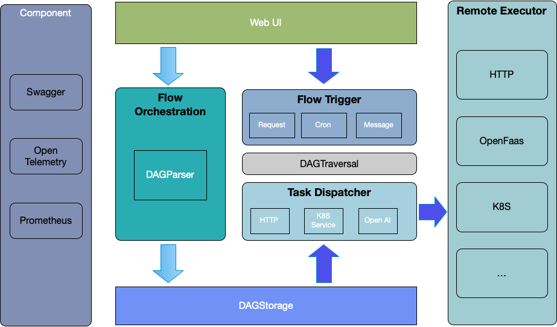

# 架构介绍

## 系统架构图

## 架构说明

Rill Flow是一个基于有向无环图（DAG）的流程编排和任务执行框架，它主要由三个功能模块组成：流程触发、流程编排和任务执行。

- **流程触发**：Rill Flow支持多种触发方式，包括定时任务触发、消息事件触发和API接口触发。用户可以根据实际需求选择合适的触发方式。
- **流程编排**：Rill Flow提供可视化和Yaml编辑两种流程图编排方式，使用户能够轻松定义和管理业务流程。
- **任务执行**：Rill Flow支持多种任务执行器的调度，如HTTP、Serverless Function、GPT接口、自定义扩展执行器和远程执行器等。用户可以根据实际需求定制任务执行器。

## 核心模块

- **DagParser**：DAG图解析器，负责解析用户定义的DAG图，生成可执行的任务流。
- **DagTraversal**：DAG图遍历器，负责遍历DAG图，选择当前可执行的任务节点。
- **TaskDispatcher**：任务执行器调度器，负责将可执行的任务节点调度至匹配的任务执行器中执行。
