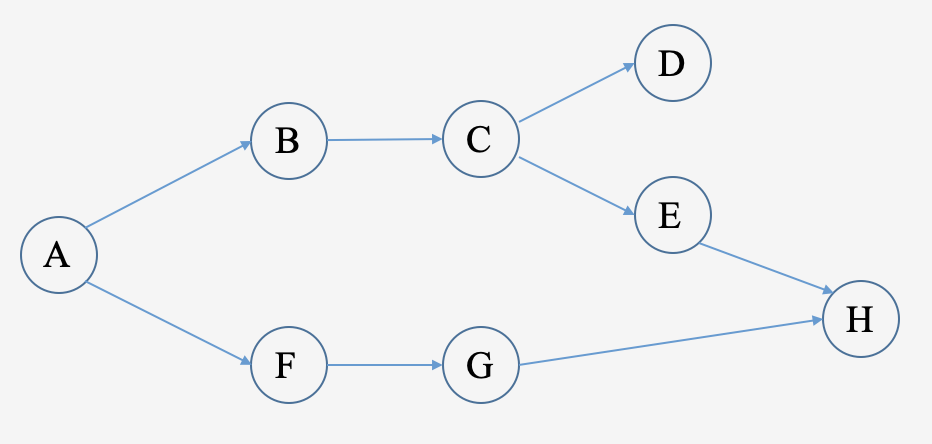

# 工作流

## 有向无环图（DAG）

Rill Flow是一套基于有向无环图（DAG）拓扑排序特性的流程编排服务，它根据任务之间的依赖关系自动进行调度和执行。

有向无环图（DAG）：在图论中，如果一个有向图从任意顶点出发，不能通过若干边返回到该点，那么这个图就是有向无环图。从计算机的角度看，DAG是用来描述一组有方向的任务集合的数据结构，每个任务都有一系列依赖关系，依赖的方向是有向的，代表着任务之间的执行顺序。

以下图表描述了基于DAG的工作流：



(图 1：基于DAG的流程示例)

1. 任务A：无依赖，可立即执行。
2. 任务B和任务F：依赖于任务A，任务A完成后可并行执行。
3. 任务C：依赖于任务B。
4. 任务D和任务E：依赖于任务C，任务C完成后可并行执行。
5. 任务G：依赖于任务F。
6. 任务H：依赖于任务E和任务G，两者都完成后才执行。

## 描述工作流

Rill Flow使用Yaml语言来描述DAG图和编排流程。选择Yaml作为流程描述语言的原因是Yaml是一种人类可读的数据序列化语言，它设计用于方便地表示各种数据结构。对于Rill Flow的用户来说，我们希望即使在没有前端显示界面的情况下，用户也能通过Yaml文件快速编排业务流程。同时，Yaml兼容了Perl、C、XML、HTML等多种编程语言的特点，可与当前大多数编程语言配合使用。

Yaml文件使用.yml或.yaml作为扩展名，并遵循特定的[语法规则](https://yaml.org/)。

以下是基于YAML的DAG（图1）示例的简单描述：

```yaml
type: flow
dagName: sample_dag
tasks:
  - name: A
    next: B,F
    category: function
  - name: B
    next: C
    category: function
  - name: C
    next: D,E
    category: function
  - name: D
    category: return
  - name: E
    next: H
    category: function
  - name: F
    next: G
    category: function
  - name: G
    next: F
    category: function
  - name: H
    category: return
```

## 提交工作流定义

### API

参考[/flow/bg/manage/descriptor](../07-api.md#创建工作流)

### [管理后台](../06-background/02-definition/02-definition-graph.md)

## 接下来

在完成工作流定义后，可以执行该工作流，每次执行都将生成一个新的工作流实例。Rill Flow会为每个实例分配必要的运行资源。

在分布式部署环境下，工作流实例的每一步可能运行在不同节点上。当工作流实例执行完成后，系统将回收相关资源。

> 更多关于工作流实施的信息，请参阅[提交工作流](../04-execution/01-execute.md)。

你也可以了解：

- [任务与派发器定义](../03-defination/02-task-and-dispatcher.md)
- [上下文与参数映射](../03-defination/04-context-and-mapping.md)
