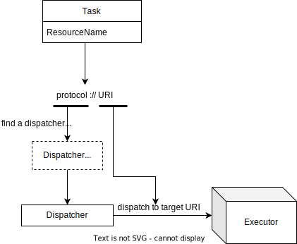

# 任务与派发器

## 任务 (Task)

任务是在 DAG (有向无环图) 中的每一个节点。在分布式执行环境中，任务可通过 `resourceName` 属性绑定到派发器（Dispatcher），派发器负责将任务信息分发给不同的执行器（Executor）。



### 任务属性

任务属性在 DAG 图的 YAML 描述文件中的 `tasks` 字段中定义。这些属性包括：

| 属性名            | 必选 | 类型    | 说明                                                         |
| ----------------- | ---- | ------- | ------------------------------------------------------------ |
| name              | 是   | string  | 任务的名称                                                   |
| category          | 是   | string  | 任务的分类，详情见[category](#category)                      |
| pattern           | 是   | string  | 任务的执行模式，可选值为同步（`task_sync`）或异步（`task_async`） |
| resourceProtocol  | 否   | string  | 指定派发器资源协议，若为空，则使用 `resourceName` 解析的协议。`resourceProtocol` 与 `resourceName` 不能同时为空 |
| resourceName      | 否   | string  | 资源描述符，详见[派发器](#派发器)                            |
| next              | 否   | string  | 下一个任务的名称                                             |
| inputMappings     | 否   | map     | 输入映射，详见[参数映射](context-and-mapping)                |
| parameters        | 否   | map     | 任务输入的默认值，若 `inputMapping` 与 `parameters` 同时定义了同一键，则以 `inputMappings` 为准 |
| outputMappings    | 否   | map     | 输出映射，详见[参数映射](context-and-mapping)                |
| tolerance         | 否   | boolean | 任务失败时是否忽略并继续执行                                 |
| successConditions | 否   | string  | 定义成功条件，优先级高于 `result_type`，若输出满足所有条件则任务成功，否则失败 |
| failConditions    | 否   | string  | 定义失败条件，优先级高于 `successConditions`，若输出满足所有条件则任务失败，否则成功 |
| retry             | 否   | map     | 对于计算类任务，如果执行失败，Rill Flow 将按照该选项配置的策略进行重试，详见[retry](#retry) |

### category

任务根据类型分为以下类别：

- **计算类任务**
  - `function`：执行具体的计算任务，例如 HTTP 或 RPC 调用任务。
- **流程控制类任务**
  - `choice`：在多个子任务中选择一个执行。
  - `foreach`：循环执行一组子任务。
  - `pass`：空任务，执行后直接标记为成功。
  - `return`：根据条件决定是否跳过后续任务。
  
  更多信息请参考[流程控制](../03-defination/05-control.md)。

### pattern

通过 `pattern` 属性可以指定任务在派发器与执行器之间的执行模式，支持同步（`task_sync`）和异步（`task_async`）模式。

### retry

重试策略，对于计算类任务，有可能存在调用失败的情况。该参数设置了失败后的重试策略，例如：

```yaml
retry:
  maxRetryTimes:3
  intervalInSeconds:2
  multiplier:1
```

retry 结构中共有三个选项：

- maxRetryTimes：最大重试次数，默认值为 0，即：不重试。
- intervalInSeconds：重试间隔秒数，默认值为 0，即：失败后立即重试。
- multiplier：重试间隔放大引子，默认值为 1，即：不放大。

Rill Flow 在计算任务执行失败后，将以上述配置中的策略进行重试。假设当前已经重试过 n 次，那么下一次重试的间隔时间为：`intervalInSeconds*multiplier^n`，最多重试 maxRetryTimes 次。

## 同步与异步任务模式

### 同步模式（`task_sync`）

在同步模式下，派发器与执行器保持连接直到任务执行完成或超时。这种模式适合执行时间在毫秒级的快速任务。

### 异步模式（`task_async`）

在异步模式下，派发器会在 Header 中添加回调地址 `X-Callback-Url`，并将任务信息传递给执行器。执行器完成任务后，会通过调用 `X-Callback-Url` 将执行结果返回给 Rill Flow。这种模式适用于重型计算或执行时间较长的任务，如 AIGC 模型生成任务。

## 派发器

### 概述

任务通过 `resourceProtocol` 属性选择派发器。同一类型的派发器可以对应多种执行器。任务通过 `resourceName` 属性绑定派发器和执行器。Rill Flow 支持多种派发器，如 HTTP 协议派发器、K8s Service 派发器、阿里云通义千问派发器、ChatGPT 派发器等。Rill Flow 也支持通过[插件](../../develop/01-plugin/02-create-plugin.md)对派发器进行扩展，提供了实现自定义派发器的灵活性。

### resourceProtocol

任务通过 `resourceProtocol` 指定派发器。这是一个可选字段。如果任务的 `resourceProtocol` 为空，则会通过 `resourceName` 解析出 `resourceProtocol`。

### resourceName

任务通过 `resourceName` 属性使用统一资源定位符（URL）的简化格式来描述派发器和执行器。常见格式为：

```txt
[协议类型]://[服务器地址]:[端口号]/[资源层级UNIX文件路径][文件名]?[查询参数]#[片段ID]
```

例如：

```txt
http://www.sample.com/callback.json
```

#### 支持的派发器类型

Rill Flow 支持以下类型的派发器：

#### HTTP协议派发器

HTTP 派发器用于转发任务信息，发起 HTTP 请求时使用 `application-json` 作为 `content-type`，并以接收到的 `json` 字符串作为输出。

##### 任务属性

| 参数               | 参数值                                | 说明                                        |
|------------------|------------------------------------|-------------------------------------------|
| resourceProtocol | http/https                          | 指定协议类型                                   |
| resourceName     | http://www.sample.com/execute.json | HTTP URL                                    |
| pattern          | task_sync/task_async               | 指定任务执行模式，同步（task_sync）或异步（task_async） |
| requestType      | get/post                           | HTTP 请求类型，默认为 post                      |

##### 输入参数

| 键                 | 值类型    | 说明                                                                                   |
|------------------|--------|--------------------------------------------------------------------------------------|
| query_params_*   | map    | GET 请求的参数，以 `query_params_` 前缀的键对应的值需为 map 类型，所有键/值以键=值形式拼接至请求 URL |
| request_header_* | map    | 请求头，以 `request_header_` 前缀的键对应的值需为 map 类型，所有键/值将加入请求头                      |
| 其余键              | string | POST 请求体参数，目前仅支持 json 类型，其余键/值将加入 POST 请求体的 json 结构中                   |

##### 输出参数

HTTP 请求返回的 `json` 结构体将被赋值给 `$.output` 变量。

> 派发至 K8s Service:
> 在 K8S 环境下，建议通过 HTTP 派发器对接 K8s Service 域名，例如 `http://service_name.namespace/execute.json`。有关 Service 的更多信息，请参考 [Kubernetes Service](https://kubernetes.io/docs/concepts/services-networking/service/)。也可以使用 [Istio](https://istio.io) 等服务网格或其他高级服务负载均衡机制。

#### ChatGPT 派发器

Rill Flow 支持 OpenAI 的 [ChatGPT 模型](https://openai.com/chatgpt)派发器。使用此派发器需要拥有 OpenAI 模型调用 Apikey。具体信息可参考[OpenAI ChatGPT 模型文档](https://platform.openai.com/api-keys)

##### 任务属性

| 参数               | 参数值       | 说明 |
|------------------|-----------|----|
| resourceProtocol | chatgpt | 使用 ChatGPT 派发器 |

##### 输入参数

| 键              | 值类型    | 说明                                                                                          |
|---------------|--------|---------------------------------------------------------------------------------------------|
| apikey        | string | Apikey 用于模型调用                                                                           |
| model         | string | 模型名称，详见OpenAI[支持的模型列表](https://platform.openai.com/docs/models) |
| prompt       | string | 请求模型的文本内容                                                                             |

##### 输出参数

ChatGPT请求返回的 `json` 结构体将被赋值给 `$.output.result` 变量。其他返回值可参考[OpenAI SDK文档](https://platform.openai.com/docs/guides/text-generation/chat-completions-response-format)。

#### 阿里云模型服务派发器

Rill Flow 支持阿里云的[灵积模型服务](https://help.aliyun.com/zh/dashscope)派发器。使用此派发器需要拥有阿里云通义千问的模型调用 Apikey。具体信息可参考[阿里云灵积模型服务文档](https://help.aliyun.com/zh/dashscope/developer-reference/activate-dashscope-and-create-an-api-key)。

##### 任务属性

| 参数               | 参数值       | 说明 |
|------------------|-----------|----|
| resourceProtocol | aliyun_ai | 使用阿里云 AI 派发器 |

##### 输入参数

| 键              | 值类型    | 说明                                                                                          |
|---------------|--------|---------------------------------------------------------------------------------------------|
| apikey        | string | Apikey 用于模型调用                                                                           |
| model         | string | 模型名称，详见阿里云[支持的模型列表](https://help.aliyun.com/zh/dashscope/developer-reference/token-api) |
| message       | string | 请求模型的文本内容                                                                             |
| message_suffix| string | （可选）请求模型的内容后缀                                                                       |
| message_prefix| string | （可选）请求模型的内容前缀                                                                       |

##### 输出参数

阿里云请求返回的 `json` 结构体将被赋值给 `$.output` 变量，其中 `$.output.output.text` 为模型的文本返回。其他返回值可参考[阿里云SDK文档](https://help.aliyun.com/zh/dashscope/developer-reference/token-api)。
