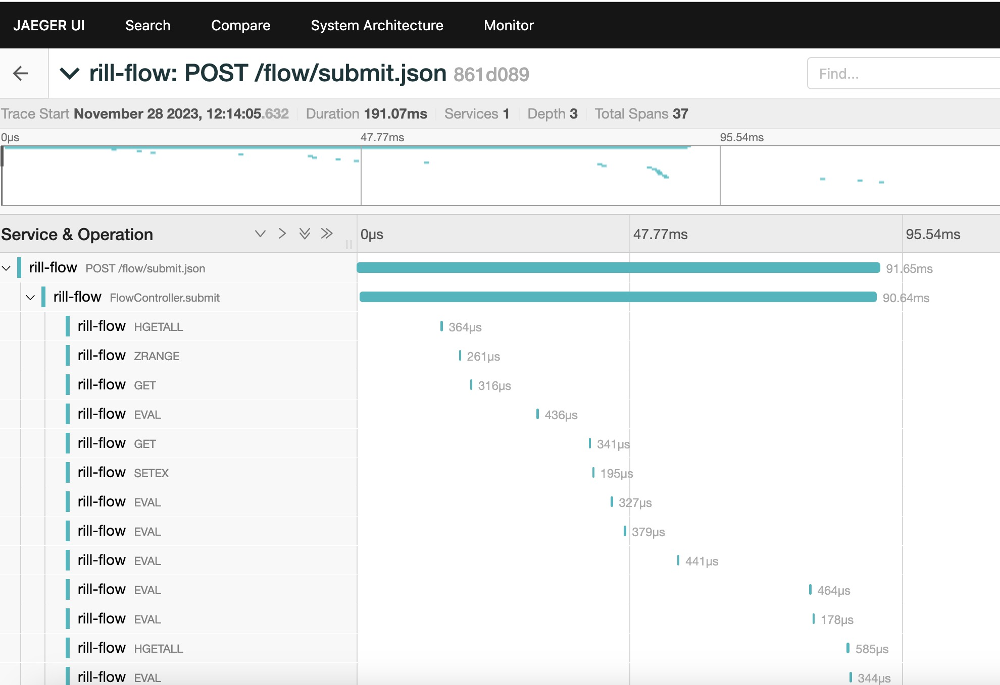

# Trace链路跟踪

## 概述

Rill Flow 作为一个高性能、可扩展的分布式流程编排系统，为了便于更好地查看和理解工作流各节点的执行情况，引入了 Trace 链路跟踪功能。这一功能基于 [OpenTelemetry](https://opentelemetry.io/docs/) 框架实现，采用 javaagent 探针的无侵入式方式，并使用 [Jaeger](https://www.jaegertracing.io/) 作为 OpenTelemetry 的输出源。Rill Flow 默认开启 Trace 功能，Jaeger 数据收集端口号默认为 4317，可视化界面端口号默认为 16686。

## 查看 Trace

- 打开 Jaeger 可视化界面：

```txt
http://127.0.0.1:16686/search
```

- Trace图



## 关闭 Trace

- 移除服务运行时的环境变量 `RILL_FLOW_TRACE_ENDPOINT`

## 自定义 Trace

### Jaeger 数据收集端口修改

- 修改服务的环境变量 `RILL_FLOW_TRACE_ENDPOINT` 

```txt
- RILL_FLOW_TRACE_ENDPOINT=http://jaeger:4317
```

### Jaeger 可视化界面端口修改

- 修改`rill-flow-ui`服务的环境变量 `TRACE_SERVER` 

```txt
- TRACE_SERVER=http://jaeger:16686
```

### 隐藏组件在链路中的信息

- 在 Rill Flow 中添加如下环境变量，其中 `JEDIS` 可替换为其他组件名称，如 `HTTP`、`JDBC` 等：

```txt
OTEL_INSTRUMENTATION_JEDIS_ENABLED=false
```
