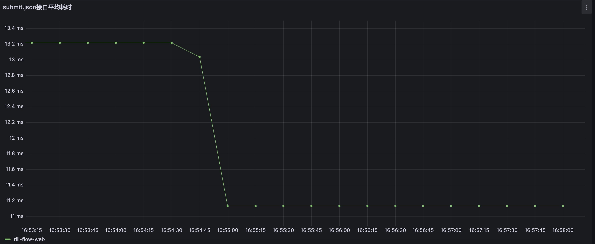

# Prometheus
## 概述
Rill Flow作为一个功能强大的工作流引擎服务，除了提供高效的工作流处理能力外，还具备系统监控的重要功能。这些监控能力是通过集成[Prometheus](https://prometheus.io/)组件来实现，从而能够轻松地配置和定制系统监控，并通过可视化功能监控Rill Flow工作流引擎的状态和性能。
## 指标路径
- 项目已默认集成Prometheus，查看监控指标收集数据
```cURL
http://127.0.0.1:8080/actuator/prometheus
```
## 监控指南
### 自定义配置prometheus.yml文件：
```yml
global:
  scrape_interval: 15s
  
scrape_configs:
  - job_name: "Rill Flow"
    metrics_path: '/actuator/prometheus'
    static_configs:
      - targets: ['host.docker.internal:8080']
```
- global：全局配置部分，用于定义全局的设置。
  - scrape_interval：数据采集的时间间隔。示例中，设置为每15秒采集一次数据。
- scrape_configs：数据采集配置部分，用于定义数据采集的目标和设置。
  - job_name：采集任务的名称，用于标识该任务。
  - metrics_path：指定要采集的指标路径。示例中设置为/actuator/prometheus，表示采集来自/actuator/prometheus端点的指标数据。
  - static_configs：静态目标配置部分，用于定义要采集的目标。
    - targets：目标的地址和端口。设置为host.docker.internal:8080，表示采集来自host.docker.internal主机的8080端口上的指标数据。
### Prometheus部署
```shell
docker run -p 9090:9090 -v /path/to/prometheus.yml:/etc/prometheus/prometheus.yml prom/prometheus
```
注：
* `/path/to`替换为实际的配置文件目录路径
### 查看Prometheus
```url
http://localhost:9090
```

## 可视化监控
### 优点
Prometheus和Grafana的结合使用可以提供强大的监控和可视化能力，帮助用户实时监控系统的性能和状态，快速识别问题并进行故障排除。它们的开源性质使得用户可以自由地使用和定制这些工具，满足特定的监控需求。
### Grafana下载地址
```URL
https://grafana.com/grafana/download
```
### 配置文档
具体Prometheus与Grafana结合使用可参考文档[Grafana对Prometheus的支持](https://prometheus.io/docs/visualization/grafana/)
### 效果图示例
- 下图是Rill Flow的submit接口的平均耗时Grafana配置示例图：
  
- Grafana配置Json如下：
```json
{
  "datasource": {
    "type": "prometheus",
    "uid": "e6f8f070-36b8-4303-8c13-10017ffb2ffe"
  },
  "fieldConfig": {
    "defaults": {
      "custom": {
        "drawStyle": "line",
        "lineInterpolation": "linear",
        "barAlignment": 0,
        "lineWidth": 1,
        "fillOpacity": 0,
        "gradientMode": "none",
        "spanNulls": false,
        "insertNulls": false,
        "showPoints": "auto",
        "pointSize": 5,
        "stacking": {
          "mode": "none",
          "group": "A"
        },
        "axisPlacement": "auto",
        "axisLabel": "",
        "axisColorMode": "text",
        "axisBorderShow": false,
        "scaleDistribution": {
          "type": "linear"
        },
        "axisCenteredZero": false,
        "hideFrom": {
          "tooltip": false,
          "viz": false,
          "legend": false
        },
        "thresholdsStyle": {
          "mode": "off"
        }
      },
      "color": {
        "mode": "palette-classic"
      },
      "mappings": [],
      "thresholds": {
        "mode": "absolute",
        "steps": [
          {
            "color": "green",
            "value": null
          },
          {
            "color": "red",
            "value": 80
          }
        ]
      },
      "unit": "s"
    },
    "overrides": [
      {
        "__systemRef": "hideSeriesFrom",
        "matcher": {
          "id": "byNames",
          "options": {
            "mode": "exclude",
            "names": [
              "rill-flow-web"
            ],
            "prefix": "All except:",
            "readOnly": true
          }
        },
        "properties": [
          {
            "id": "custom.hideFrom",
            "value": {
              "legend": false,
              "tooltip": false,
              "viz": true
            }
          }
        ]
      }
    ]
  },
  "gridPos": {
    "h": 8,
    "w": 12,
    "x": 0,
    "y": 0
  },
  "id": 1,
  "options": {
    "tooltip": {
      "mode": "single",
      "sort": "none"
    },
    "legend": {
      "showLegend": true,
      "displayMode": "list",
      "placement": "bottom",
      "calcs": []
    }
  },
  "targets": [
    {
      "datasource": {
        "type": "prometheus",
        "uid": "e6f8f070-36b8-4303-8c13-10017ffb2ffe"
      },
      "editorMode": "code",
      "expr": "http_server_requests_seconds_sum{uri=\"/flow/submit.json\"}/http_server_requests_seconds_count{uri=\"/flow/submit.json\"}",
      "instant": false,
      "legendFormat": "rill-flow-web",
      "range": true,
      "refId": "A"
    }
  ],
  "title": "submit.json接口平均耗时",
  "type": "timeseries"
}
```
