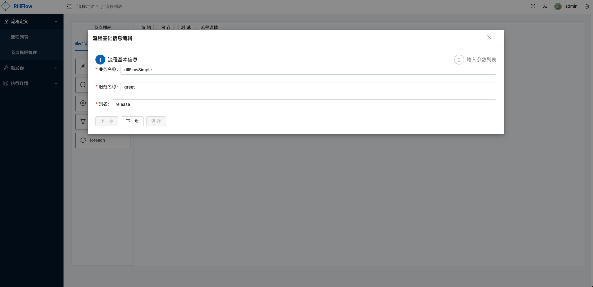
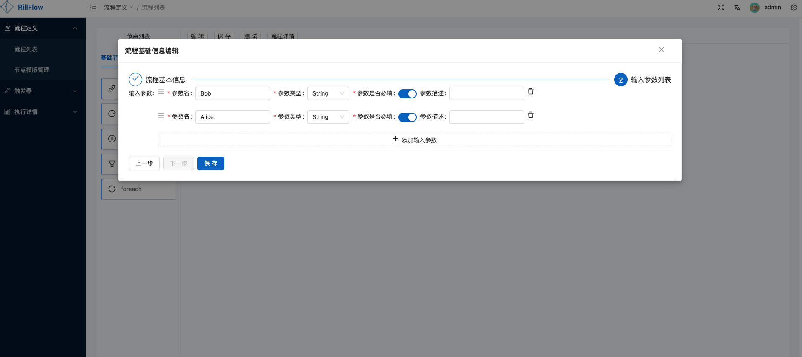
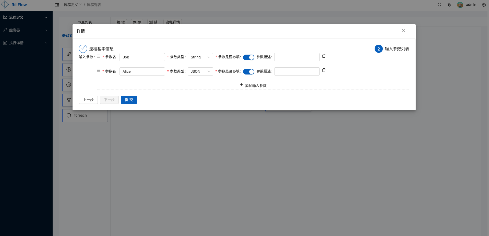
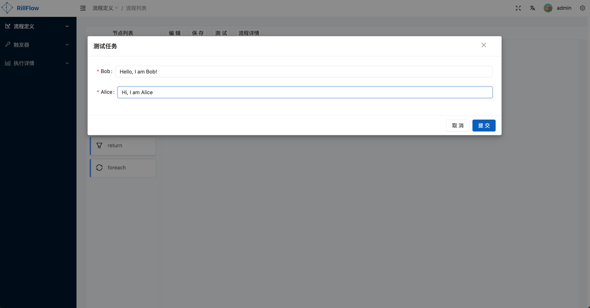
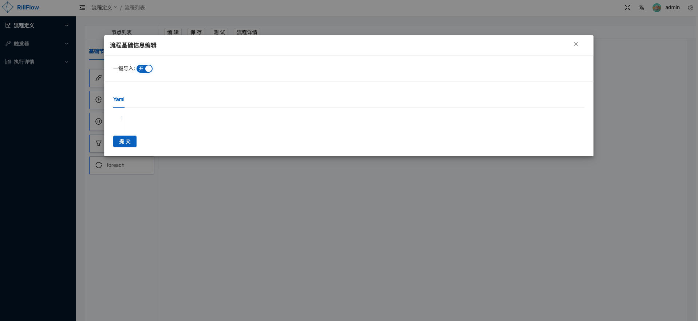

# 新建工作流
目前支持两种方式创建工作流，一种是通过rill-flow系统后台手动创建工作流，另一种是将已有工作流一键导入。
## 手动创建工作流
手动创建工作流主要需要两步操作，首先需要创建工作流基础信息，然后根据业务需求使用节点列表中的节点构建工作流。
### 工作流基础信息

#### 定义工作流元信息
需要填写的信息有业务名称，服务名称和别名。具体含义见[关键名词说明](../../../getting-started/03-explain.md#关键名词说明)。

#### 定义工作流输入参数列表
该列表是工作流启动的初始参数。初始参数支持四种类型: String, Number, Boolean, JSON。

### 根据业务构建流程图
根据业务需求使用节点列表中的节点构建工作流。节点列表主要有基础节点和模版节点。

#### 基础节点
- [pass](../../03-defination/05-control.md#paas)
- suspense
- [return](../../03-defination/05-control.md#return) 
- [foreach](../../03-defination/05-control.md#foreach)
- [function](../../03-defination/02-task-and-dispatcher.md)

#### 模版节点
详见[节点模版列表](./03-node-template.md)

### 保存工作流
点击`保存`按钮，校验`流程基本信息`和`输入参数列表`后即可保存工作流。

### 测试工作流
点击`测试`按钮，输入具体参数值后点击提交。

## 一键导入工作流
为了方便用户快速创建工作流，我们提供了将一键导入工作流的功能。

> 目前提供[多个示例工作流](../../../getting-started/02-sample.md)，可以直接导入使用。已有工作流的yaml信息可通过的`流程详情`按钮查看。

