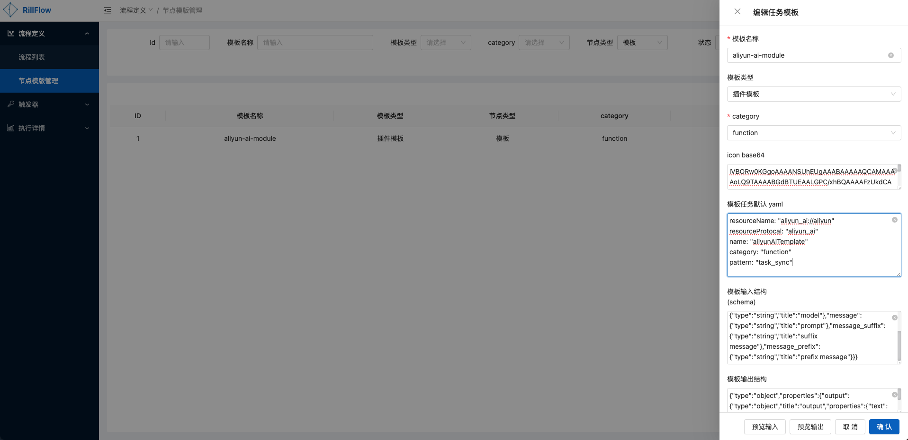

# 节点模版管理

节点模版是为用户定制化节点的一种方式，用户可以在节点模版中定义节点的资源、配置信息。在工作流编排的过程中使用节点模版，以提升任务接入效率。

## 模版创建

### 具体参数

|    参数名     |  参数类型  | 是否必填  |                                          参数说明                                          |
|:----------:|:------:|:-----:|:--------------------------------------------------------------------------------------:|
|    模版名称    | string | true  |                                                                                        |
|    模版类型    | string | false |                                    包含函数模版，插件模版，逻辑模版                                    |
|  category  | string | true  |      任务的分类，详情见[category](../../03-defination/02-task-and-dispatcher.md#category)       |
|    icon    | string | false |                    节点的展示icon。详见下文[节点图标](./03-node-template.md#节点图标)                    |
| 模版任务默认yaml | string | false |                   详见下文[模版任务默认yaml](./03-node-template.md#模版任务默认yaml)                   |
|   模版输入结构   | string | false | 节点输入参数; 参数格式为[JSON Schema](https://json-schema.org/learn/getting-started-step-by-step) |
|   模版输出结构   | string | false | 节点输出参数; 参数格式为[JSON Schema](https://json-schema.org/learn/getting-started-step-by-step) |

### 参数详情
#### 节点图标
目前支持图片base64和[Ant Design Vue图标](https://antdv.com/components/icon-cn)
- 图片base64
  - 将图片转成base64格式
  - 示例
    ```text
    iVBORw0KGgoAAAANSUhEUgAAAIAAAACACAYAAADDPmHLAAAAAXNSR0IArs4c6QAAC3BJREFUeF7tXXuMHVUZ/76ZvY3txgpiAkXbGEUgGiUGjFpLrYaiAimiGElQULStJljZ3Xu+uRur24vdvXPO7G6RWJUiqICpj0SQR4zFR1UqUcEHBnwU8f2MQdSuG7d75zOn3C232zt3Zu6de+64c07SP7rzne/x+373mzmPOYNgW6ERwEJHb4MHS4CCk8ASwBKg4AgUPHxbASwBCo5AwcO3FcASoOAIFDx8WwEsAQqOQMHDtxXAEqDgCBQ8fFsBLAEKjkDBw7cVwBKg4AgUPHxbASwBCo5AwcO3FcASoOAIFDx8WwEsAQqOQMHDtxXAEqDgCBQ8fFsBLAGWHgJSyh2IeCkAvCjj6PbX6/Xq6Ojo/oz19k3dkqwASqlvAsCGHqG6n4he0yPdxtUuVQJwL5EkoiWD25IJpDnhSilLgIS/AEuAhEA1i9kK0AFoJrvYCpAc7UJVgLS/3CgipdWTPB3mJS0B2mBuCWCekJlYzCpxWenJJKgeKcllBZienn7m4cOHt+mYmfmLlUrl4TTxZ5W4rPQEQXBeGIbrdAye5+1IE0uvZXNHgLGxsZWDg4P/bAr83wCwi4jGkoChlDoXAL7dSjbtvTuKAI7jnFsul++L80dKearOOSIeIfNCS+tHnJ1urueOAEqp7wPAy1oE9XMAkET06VYBSynPQMRxAHhzFCBpgY8ZTewdGBgQw8PDf2xlLwiCrcwsAeAZLa4PE9GubhKXVd9cEUBKuRER98UE9w1mvtrzvJ9puVqtdqLrujUA2BoHSsYEWDCniMhb+I/v++td172OmV/azp+0vsTF1un1XBEgCIJ/MPMJSYJh5mnHcWaZ+QNJ5LVMWtCTzicw8yFEHAKA17erQM1+MvONnudtSep7r+RyQwCl1HYA+HCvAgWArxHRxjT6lVJfaSQ1TbfEssz8bM/z/pS4Qw8E80SAXszf/wIA7qrX6x8fHR19rBP8pqamTg/D8B3M/E4AOKUTHVF9EPE+IYR+aO1bywUBlFJfAoBLIlDQQ8C06/pPIKIvhNAPYZm0nTt3ri6VSsOIeE1ahcx8DyJeGNFvAxF9K63OrOT7ToAgCF7CzD+JCOheIjo/CIIxZk46fr4tDEM/7dxBUkB931/nOM5wG8IeVcXMv3Qcp+o4zsP1ev3rAHBSCzuPE1Grvyd1qSu5vhNASnkAEde2ioKZL/Y87059bXp6+rT5+fkJAHhLRMQ/BgCfiD7fFSIJO0spL0dE/fT/4oguo0TkL1yTUl6LiB9sJYuIW4QQNyY0nalYXwkQBMFmZt4TEdHNRPSuxdd833+D4zhB820BEYNDhw7trFar/8oUnRhl4+Pjq0ql0icAYFOT6N4wDCuVSuV3zd0nJiZOGhgY0KW+5e1sZmbGrVaroUn/ta1+E+AgM5/WIuhZ13VfNTIy8qMoQJRS7wOA65n5fM/z7jUNXLM9KaUeil4RhuHWdvsFlVLvBYCPRfg6SUTCdBx9I4BSSg/59NDvuMbM1bzNmWeVGKWUJut5EXGf6XmeHrkYa30hwPj4+MmlUukgADx9caTM/Kjruq8sl8t/N4aCQUO+71/oOM7dESbvJKKLDbrTn1uAlHIPIm6OCHQzEX3SJAimbQVBcAszv72VXUTcJIS4y5RPxitArVZ7reu6ekjUqvV0y3Vj3eB8RNzIzGcBwMmNfzMA8BcA+Csz3+04zneFEPf3KgkTExMvdF33B4i4ooWNg0R0eq9sL9ZrnABKqS8vemo+6lMYhhdUKhU9/Zpp27Vr16q5ubmtjaqjl2iTtO8BwEeIaG8S4bQy7YaFzFz2PG8qrc5O5I0SIAiCy5g5CtDPEtHbOgmiXR+llJ43uA4AkiZ+sbo7EHGrEOJvWfo2Njb2tBUrVvwUEVuNgiAMwxMqlUrzvogszR/VZZQASildVl8REcluZt69sMybRbSNyZrbMtD1BDNv9DzvgQx0HVGhlHo1M29DxDdF6LyBiN6Tlb0oPcYI4Pv+GsdxftsuIGb+MwBoEuiNHV21IAiuYeZMN124rrtmZGTk9904ppQ6pZH40Tg9aZev4/S1um6MAHrOPwzDfYioH7zi2g8RUQohvhAn2Oq6lPKNiHh7J31jCPrg7Ozs+h07dvynE92Tk5NXhmF4LQCsieuvF5A8z7soTq7b68YIoB1tJEbPj5+R0HG9DlAmIj1nkLhJKR9AxLPbdLgZAO4Pw/CR2dnZh1auXHni/Pz8mdovRNTPIS9v03cPEcXuPmru7/v+Wr1riZnXJwkCEb9ar9e3LJ5OTtI3rYxRAmjnGkOxit6gk9TZNDODUsotiHhDlO7mBaYoGaWUfm64POq64zjnlMvlB5P4r5T6jJ4mTiILAL9CxJoQ4qaE8l2LGSfAgseTk5Nnh2H4oaghYXNkjuNcUS6Xb00Sbbtff5p7qlLqAgC4J8Jm4iqglNLJvCrOd03y5cuXT2/bts3oglbfCLAASGOYptcF2t0W1hHRgTgQpZSbEFHPM7RqekyfajNHEAR7mLnVjOXjMzMzq6rV6lycT0opXe30ptWodrvjONvL5fIjcbp6cb3vBFgISkqp988fXT9vDrZUKp06NDSkRwhtm1JKPzQet1+g061XtVrtuXrGDgCetdgwIl4khIiqEEfFfd+/zHGcVnMfutwLIUTmD6txODVfzw0BtFPdvIkzNja2bHBw8L+tgmfmqzzP+1QaYJoq1OcA4K0t+k4QUeyO5FqttsF1XX1iyeLW02nvpLEuGQJMTU2trtfrx2zCWAChXq+/YHR09NGkoDTLSSl3IuJxiUbEm4QQ747TaQkQh1DT9W4qgJTyHETU5fqYxsyPeZ73/BRuHCOqlNK/fl0FFutNNE63BEiBvCVACrAyErW3gBgg7S0gI6YlUdNNBbAPgUkQPl4mNxXADgM7S2C3vfpOADsRBMWcCLJTwceNKooxFWwXg9oW7aW9GGSXg5MvByPisIn1AWPPAHZDCECaDSEAsI+IXtftQ15cf2MEsFvCnkxFii1hfyCi1XEJ7Pa6MQI0grebQhsZS7ApdDcRXd1tguP6GyWA3Rb+VDrabQvXm2OXLVu2dmho6DdxCez2ulECNKqAfTHkyf2R7c4LGBFCTHeb3CT9jRPAvhoGEPNq2AEiOnKqqIlmnAA6KPtyaPTLocx8ied5d5hIvrbRFwLY18Nbvx6OiLcKIZLuIM6EI30hQONZwB4QsSiFiHiWEOKhTDKbUEnfCKD9C4LAHhHTSFSadx8S5jaRWL8JYA+JeooAKz3P0yejG219JUDjgbDwx8QBwJVEdIvRzDeM9Z0ASQ6KbHwJNNH3AgDg/+2gyF8T0fP6kfy+jQIWB1vwo2LXE9F3Ck2AxqigcIdFm1rxa0euvt8CFpwr4nHxc3Nzz9m+fXvLL46Yqgi5IUBjWFiYD0Yg4keFEPq00762XBHAfjLGPBdyRYDGs8CS/2gUIr5fCHG9+XQfbzF3BLCfjTNLi9wRQIdvPxxpjgS5JEC34Xfzilmz7az0dBtPL/tbArRB1xKgl9Troe6sEpeVnh6G2rXqQlWArtFqKEhz2lhWNnulxxKgA2QtAToAzWSXpJ987dQnS4BOkTPUzxIgOdBL9Ragj2XbkByGVJK5ON4tlcdthJckARobSC7t4JOzcbjur9fr1XafhotTkLfrS5IAeQM5z/5YAuQ5OwZ8swQwAHKeTVgC5Dk7BnyzBDAAcp5NWALkOTsGfLMEMABynk1YAuQ5OwZ8swQwAHKeTVgC5Dk7BnyzBDAAcp5NWALkOTsGfLMEMABynk1YAuQ5OwZ8swQwAHKeTVgC5Dk7BnyzBDAAcp5NWALkOTsGfLMEMABynk1YAuQ5OwZ8swQwAHKeTVgC5Dk7BnyzBDAAcp5NWALkOTsGfLMEMABynk1YAuQ5OwZ8+x/KkOLMeCJQyAAAAABJRU5ErkJggg==
    ```
- [Ant Design Vue图标](https://antdv.com/components/icon-cn)
  - 格式: `ant-design:{icon}`
  - 示例: `ant-design:api-outlined`

#### 模版任务默认yaml
该参数是展示节点的默认配置，具体参数详见[任务属性](../../03-defination/02-task-and-dispatcher.md#任务属性)
- 示例
  - [HTTP协议派发器](../../03-defination/02-task-and-dispatcher.md#HTTP协议派发器)模版制作
    ```text
    resourceName: "http://www.sample.com/execute.json"
    resourceProtocal: "http"
    name: "httpDemo"
    category: "function"
    pattern: "task_sync"
    ```
  - [阿里云模型服务派发器](../../03-defination/02-task-and-dispatcher.md#阿里云模型服务派发器)模版制作
    ```text
        resourceName: "aliyun_ai://aliyun"
        resourceProtocal: "aliyun_ai"
        name: "aliyunAiTemplate"
        category: "function"
        pattern: "task_sync"
    ```
    


