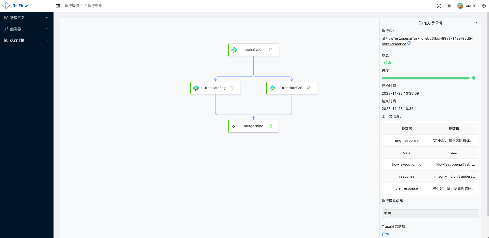
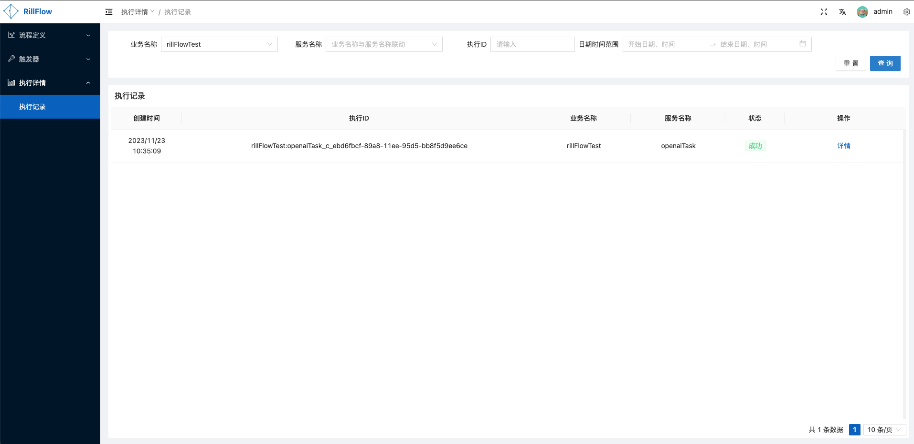

# 执行管理

## 工作流执行发起 

### [后台单次发起](./02-definition/02-definition-graph.md#测试工作流)

### [触发器发起](../04-execution/02-trigger.md)

## 执行详情查看
### 工作流执行详情具体内容：
  * [上下文信息](../../user-guide/03-defination/04-context-and-mapping.md#上下文)
  * 执行进度，[执行状态](/docs/user-guide/04-execution/03-status.md#任务状态)等信息
  * 任务[Trace信息](../05-monitor/01-trace.md)
  * 节点的执行信息

## 工作流执行列表

